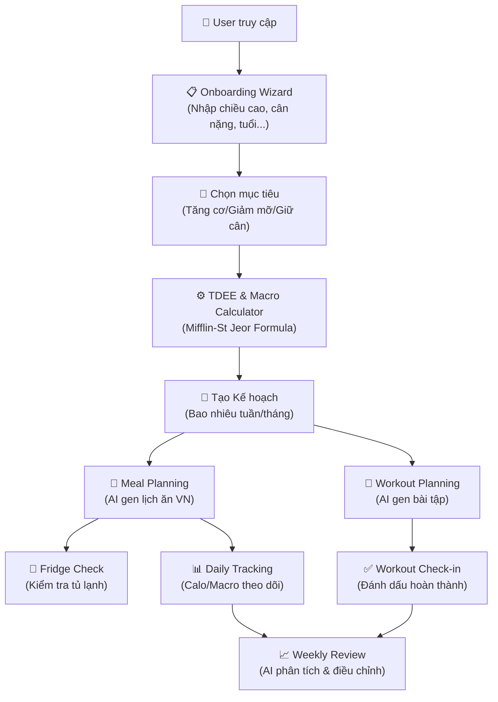
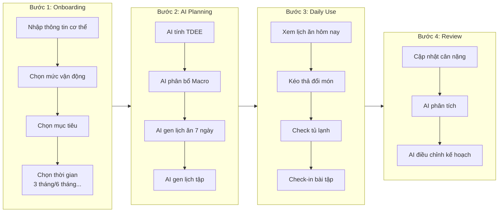
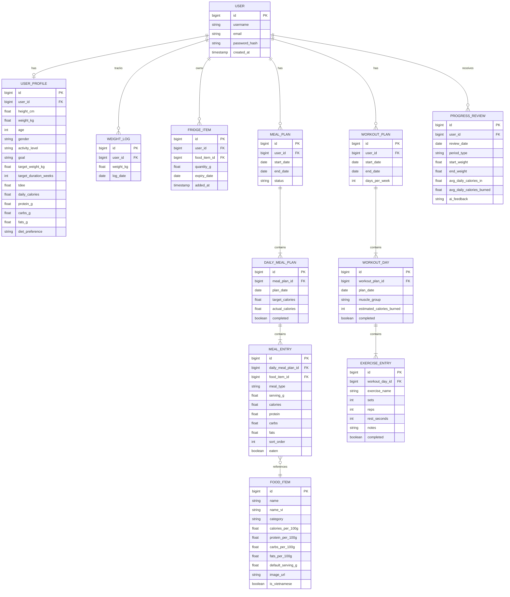

# 🏋️ Nutrition Tracker - Implementation Plan

> **Tech Stack**: Spring Boot 4.0.3 + Spring AI (Ollama) | Java 21 | MySQL | HTML/CSS/JS (REST API frontend) | Lombok
>
> **AI Model**: Ollama - `${OLLAMA_MODEL:gpt-oss:120b-cloud}`
>
> **Architecture**: REST Controller + Static HTML/JS (không dùng Thymeleaf)

---

## Tổng quan hệ thống



---

## User Flow chi tiết



---

## Database Schema



---

## Proposed Changes

### Phase 1: Foundation & User Profile

#### [MODIFY] application.properties
Cấu hình MySQL, Ollama AI, static resources, file upload:
```properties
# MySQL
spring.datasource.url=jdbc:mysql://localhost:3306/nutrition_tracker
spring.datasource.username=root
spring.datasource.password=root
spring.jpa.hibernate.ddl-auto=update
spring.jpa.show-sql=true

# Ollama AI
spring.ai.ollama.base-url=http://localhost:11434
spring.ai.ollama.chat.model=${OLLAMA_MODEL:gpt-oss:120b-cloud}

# Static resources
spring.web.resources.static-locations=classpath:/static/

# File upload (for meal image recognition)
spring.servlet.multipart.max-file-size=10MB
```

---

#### [NEW] entity/User.java
Entity chính cho người dùng (username, email, password).

#### [NEW] entity/UserProfile.java
Entity chứa thông tin cơ thể, mục tiêu, TDEE, macro values. Quan hệ `@OneToOne` với `User`.

#### [NEW] entity/WeightLog.java
Track lịch sử cân nặng theo ngày.

#### [NEW] repository/UserRepository.java
#### [NEW] repository/UserProfileRepository.java
#### [NEW] repository/WeightLogRepository.java

#### [NEW] service/TdeeCalculatorService.java
Logic tính toán:
- **TDEE** bằng công thức Mifflin-St Jeor:
    - Nam: `(10 × weight) + (6.25 × height) - (5 × age) + 5`
    - Nữ: `(10 × weight) + (6.25 × height) - (5 × age) - 161`
    - Nhân với Activity factor (1.2 ~ 1.9)
- **Macro Allocation** theo mục tiêu:
    - Tăng cơ (Bulk): TDEE + 300~500 cal → Protein 30%, Carb 45%, Fat 25%
    - Giảm mỡ (Cut): TDEE - 300~500 cal → Protein 35%, Carb 35%, Fat 30%
    - Giữ cân (Maintain): TDEE → Protein 25%, Carb 50%, Fat 25%

#### [NEW] service/UserService.java
Xử lý logic tạo user, cập nhật profile, lấy thông tin.

#### [NEW] controller/UserController.java
REST endpoints:
| Method | Endpoint | Mô tả |
|--------|----------|-------|
| `POST` | `/api/users/register` | Đăng ký user mới |
| `POST` | `/api/users/{id}/profile` | Tạo/cập nhật profile + auto tính TDEE |
| `GET` | `/api/users/{id}/profile` | Lấy thông tin profile + TDEE + Macros |
| `POST` | `/api/users/{id}/weight-log` | Ghi nhận cân nặng mới |
| `GET` | `/api/users/{id}/weight-log` | Lịch sử cân nặng |

#### [NEW] static/index.html
Trang chính - Onboarding Wizard 4 bước:
1. **Step 1**: Nhập thông tin cơ thể (height, weight, age, gender)
2. **Step 2**: Chọn mức vận động & mục tiêu (tăng cơ/giảm mỡ/giữ cân)
3. **Step 3**: Chọn thời gian (bao nhiêu tuần/tháng), cân nặng mục tiêu
4. **Step 4**: Hiển thị TDEE, daily calories, macro breakdown → Xác nhận

---

### Phase 2: Food Database & Fridge Management

#### [NEW] entity/FoodItem.java
Entity món ăn Việt Nam với thông tin dinh dưỡng (calories, protein, carbs, fats per 100g).

#### [NEW] entity/FridgeItem.java
Entity quản lý tủ lạnh - `@ManyToOne` tới `User` và `FoodItem`.

#### [NEW] repository/FoodItemRepository.java
#### [NEW] repository/FridgeItemRepository.java

#### [NEW] config/FoodDataSeeder.java
`CommandLineRunner` để seed ~50+ món ăn Việt Nam phổ biến:
- Phở bò, Bún bò Huế, Cơm tấm, Bánh mì thịt, Gỏi cuốn...
- Nguyên liệu: Thịt gà, Cá, Đậu hũ, Rau muống, Trứng...

#### [NEW] controller/FoodController.java
| Method | Endpoint | Mô tả |
|--------|----------|-------|
| `GET` | `/api/foods` | Danh sách tất cả món ăn |
| `GET` | `/api/foods/search?q=` | Tìm kiếm món ăn |
| `GET` | `/api/foods/{id}` | Chi tiết 1 món ăn |

#### [NEW] controller/FridgeController.java
| Method | Endpoint | Mô tả |
|--------|----------|-------|
| `GET` | `/api/users/{id}/fridge` | Xem tủ lạnh |
| `POST` | `/api/users/{id}/fridge` | Thêm nguyên liệu vào tủ |
| `PUT` | `/api/users/{id}/fridge/{itemId}` | Cập nhật số lượng |
| `DELETE` | `/api/users/{id}/fridge/{itemId}` | Xóa khỏi tủ |

#### [NEW] static/fridge.html
UI quản lý tủ lạnh.

---

### Phase 3: Meal Planning & Tracking

#### [NEW] entity/MealPlan.java, DailyMealPlan.java, MealEntry.java
Entities cho kế hoạch ăn uống.

#### [NEW] service/AiMealPlanService.java
Tích hợp Spring AI + Ollama để generate lịch ăn 7 ngày theo TDEE/Macro targets, Vietnamese food.

#### [NEW] service/AiImageRecognitionService.java
Vision Model qua Ollama: phân tích ảnh chụp món ăn → tên món + calo/macros.

#### [NEW] controller/MealPlanController.java
| Method | Endpoint | Mô tả |
|--------|----------|-------|
| `POST` | `/api/users/{id}/meal-plans/generate` | AI generate lịch ăn 7 ngày |
| `GET` | `/api/users/{id}/meal-plans/current` | Lấy meal plan hiện tại |
| `PUT` | `/api/users/{id}/meal-entries/{entryId}/reorder` | Kéo thả đổi vị trí |
| `POST` | `/api/meals/recognize-image` | Upload ảnh → AI nhận diện |

#### [NEW] static/meal-plan.html
UI lịch ăn: drag & drop, panel tủ lạnh, progress bar calo/macros.

---

### Phase 4: Workout Planning

#### [NEW] entity/WorkoutPlan.java, WorkoutDay.java, ExerciseEntry.java

#### [NEW] service/AiWorkoutService.java
AI generate lịch tập: bài tập, sets, reps, rest time, calories burned.

#### [NEW] controller/WorkoutController.java
| Method | Endpoint | Mô tả |
|--------|----------|-------|
| `POST` | `/api/users/{id}/workout-plans/generate` | AI generate lịch tập |
| `GET` | `/api/users/{id}/workout-days/{date}` | Lấy bài tập hôm nay |
| `POST` | `/api/users/{id}/workout-days/{dayId}/check-in` | Check-in hoàn thành |

#### [NEW] static/workout.html

---

### Phase 5: Progress Review & AI Feedback

#### [NEW] entity/ProgressReview.java

#### [NEW] service/ProgressService.java, AiProgressService.java
Aggregation calo + AI phân tích tiến độ.

#### [NEW] controller/ProgressController.java
| Method | Endpoint | Mô tả |
|--------|----------|-------|
| `GET` | `/api/users/{id}/progress/weekly` | Báo cáo tuần |
| `POST` | `/api/users/{id}/progress/analyze` | AI phân tích & lời khuyên |

#### [NEW] static/dashboard.html
Dashboard với Chart.js, AI feedback card.

---

### Shared / Config

#### [MODIFY] pom.xml
- Bỏ `spring-boot-starter-thymeleaf`
- Giữ: webmvc, spring-ai-ollama, JPA, MySQL, Lombok, Validation

#### [NEW] config/CorsConfig.java
#### [NEW] exception/GlobalExceptionHandler.java
#### [NEW] dto/ApiResponse.java

---

## Cấu trúc thư mục

```
src/main/java/david/nguyen/nutrition_tracker/
├── NutritionTrackerApplication.java
├── config/
│   ├── CorsConfig.java
│   └── FoodDataSeeder.java
├── controller/
│   ├── UserController.java
│   ├── FoodController.java
│   ├── FridgeController.java
│   ├── MealPlanController.java
│   ├── WorkoutController.java
│   └── ProgressController.java
├── dto/
│   ├── ApiResponse.java
│   ├── UserProfileRequest.java
│   ├── MealPlanResponse.java
│   └── WorkoutPlanResponse.java
├── entity/
│   ├── User.java, UserProfile.java, WeightLog.java
│   ├── FoodItem.java, FridgeItem.java
│   ├── MealPlan.java, DailyMealPlan.java, MealEntry.java
│   ├── WorkoutPlan.java, WorkoutDay.java, ExerciseEntry.java
│   └── ProgressReview.java
├── exception/
│   └── GlobalExceptionHandler.java
├── repository/ (12 repositories)
└── service/
    ├── UserService.java, TdeeCalculatorService.java
    ├── FridgeService.java, MealPlanService.java
    ├── AiMealPlanService.java, AiImageRecognitionService.java
    ├── WorkoutService.java, AiWorkoutService.java
    └── ProgressService.java, AiProgressService.java

src/main/resources/
├── application.properties
├── docs/ (this file)
└── static/
    ├── index.html, dashboard.html, meal-plan.html, fridge.html, workout.html
    ├── css/style.css
    └── js/app.js, onboarding.js, dashboard.js, meal-plan.js, fridge.js, workout.js
```

---

## Kế hoạch triển khai

| Phase | Mô tả | Ưu tiên |
|-------|--------|---------|
| **1** | Foundation + User Profile + TDEE + Onboarding | 🔴 Cao nhất |
| **2** | Food DB + Fridge Management | 🟠 Cao |
| **3** | Meal Planning + AI + Drag & Drop | 🟡 Trung bình-cao |
| **4** | Workout Planning + AI + Check-in | 🟢 Trung bình |
| **5** | Progress Review + AI Feedback + Dashboard | 🔵 Sau cùng |
